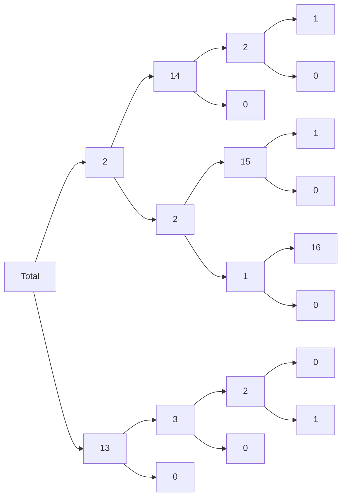
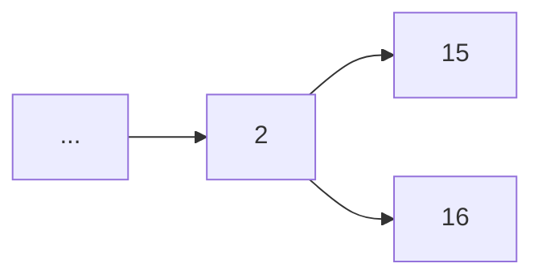
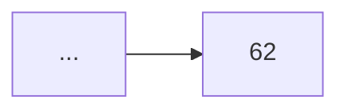

# Problem 162
## Prompt 
In the hexadecimal number system numbers are represented using $16$ different digits: $$1,2,3,4,5,6,7,8,9,A,B,C,D,E,F$$ The hexadecimal number $AF$ when written in the decimal number system equals $10\times16+15=175$.

In the $3$-digit hexadecimal numbers $10A, 1A0, A10,$ and $A01$ the digits $0, 1$ and $A$ are all present.  
Like numbers written in base ten we write hexadecimal numbers without leading zeroes.

How many hexadecimal numbers containing at most sixteen hexadecimal digits exist with all of the digits 
$0, 1$ and $A$ present at least once?  
Give your answer as a hexadecimal number.

(A, B, C, D, E and F in upper case, without any leading or trailing code that marks the number as hexadecimal and without leading zeroes, e.g. 1A3F and not: 1a3f and not 0x1a3f and not $1A3F and not #1A3F and not 0000001A3F)
## Methodology  
### Methods of Counting
Enumerating all strings that follow this would take too long to be practical, and there is unnecessary because whether the digit is $B$ or $C$ doesn't change the information gained about what the other digits need to be. We will also need to keep track of what required digits were added. Keeping this in mind, we can specify a specific size we are looking for and enumerate through the possible values of each digit sequentially.
### The First Digit
The first digit is interesting because it is the only digit without 16 possible choices, because we cannot have leading zeros. This means the range of possibilities splits into two separate cases, one where the first digit is either $A$ or $1$, and one where it is not.
### Further Digits
Following digits will also be split based on whether the digit is one needed but not included, however now we will need to account for possibly having added a needed digit in the future. For example if the first digit was $A$, then the second digit has two cases, one where it is $0$ or $1$, and one where it is not. Adding another $A$ after adding it initially is equivalent to adding a $B$. Further digits will continue branching like this, until we either get a valid branch or an invalid branch. A valid branch is determined by if all $3$ of the digits are included.
### Diagram
Below is a diagram representing the tree that the solution will construct for $4$ digit hexadecimal numbers:

Here the zeros represent branches that never end in a valid hexadecimal character.
To calculate `Total`, take a node with leaf children, add them and multiply them by the nodes value. Then replace the nodes value with the calculated value and delete the children. Repeat until only one node remains.
So 

becomes 

Now we can just implement this algorithm and sum all of the values from lengths 3 to 16.
 ## Code
 

    #include <stdlib.h>
	#include <stdio.h>
	long factorial(long n) {
	        if(n == 1)
	                return 1;
	        return n*factorial(n-1);
	}

	long power(long n, long e) {
	        long a = 1;
	        while(e) {
	                if(e&1)
	                        a *= n;
	                n *= n;
	                e >>= 1;
	        }
	        return a;
	}

	long addDig(long size, long ind, long contains) {
	        long sum = 0;
	        //printf("HERE\n%d, %d, %d\n", size, ind, contains);
	        if(size-ind < 3-contains)
	                return 0;
	        if(size-ind == 3-contains)
	                return factorial(3-contains);
	        if(contains == 3) {
	                return power(16, size-ind);
	        }
	        sum += (3-contains) * addDig(size, ind+1, contains+1);
	        sum += (16-3+contains) * addDig(size, ind+1, contains);
	        return sum;
	}

	long count(long size) {
	        long sum = 0;
	        sum += 13*addDig(size, 1, 0);
	        sum += 2*addDig(size, 1, 1);
	        return sum;
	}

	int main() {
	        long sum = 0;
	        for(long i = 3; i < 17; i++) {
	                sum += count(i);
	        }
	        printf("%lX\n", sum);
	}
## Answer
When run we get our solution:

    gcc Problem162.c && time ./a.out
    3D58725572C62302

	real    0m0.001s
	user    0m0.000s
	sys     0m0.000s

> Written with [StackEdit](https://stackedit.io/).
