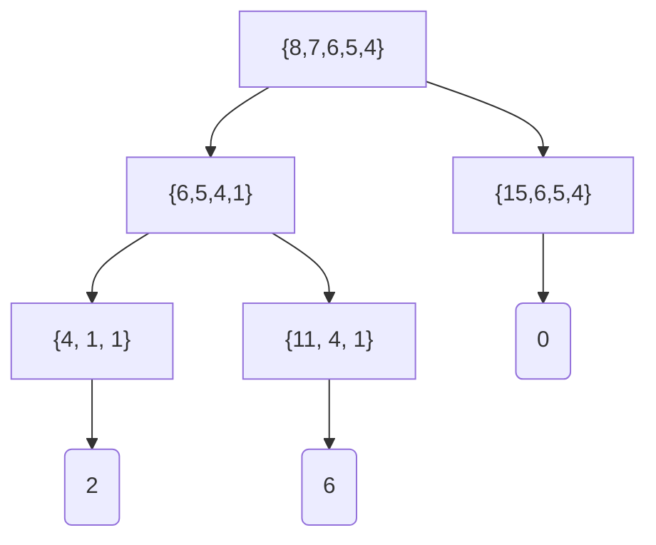
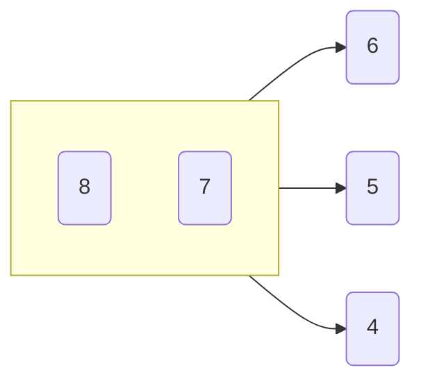

# Problem 266
## Question
The divisors of $12$ are: $1, 2, 3, 4, 6$ and $12$.  
The largest divisor of $12$ that does not exceed the square root of $12$ is $3$.  
We shall call the largest divisor of an integer $n$ that does not exceed the square root of $n$ the pseudo square root $(PSR)$ of $n$  
It can be seen that $PSR(3102) = 47$

Let $p$ be the product of the primes below $190$.  
Find $PSR(p)$.
## Methodology  
### Translation into a Partition Problem
#### Finding a goal
When solving these problems usually it is important to look at the information given. We are given one relatively important piece of information about $p$, which is its prime factorization, a usually important but difficult piece of information to compute about a number, so it is important to consider what we can do with this.

Let $S$ be the set of prime factors of $p$. Create $S_1$ and $S_2$ such that $S_1 \cup S_2 = S \wedge S_1 \cap S_2 = \emptyset$, also known as a partition. Then, 
$$p = \prod_{k\in S_1} k \times \prod_{j \in (S-S_1)} j$$
where $S_1$ is the set of prime factors comprising one factor of $p$ and $S_2 = S-S_1$ is the set of prime factors comprising its complimentary factor. For $n$ in general, how do its $S_1$ and $S_2$ compare for the "best case" where $PSR(n) = \sqrt n$? In this case the products of $S_1$ and $S_2$ are equal, because they both multiply to its square root:
$$0 = \prod_{k\in S_1} k - \prod_{j \in S_2} j $$
For $\sqrt n \notin \mathbb{N}$, the $PSR(n)$ minimizes the difference between two complimentary factors, as they approach $\sqrt n$:
$$\argmin_{S_1 \subset S} \left| \prod_{k\in S_1} k - \prod_{j \in S_2} j \right| $$ 
Now $\argmin_{S_1\subset S}$ yields the pseudo square root of $n$ or its complimentary factor (which can be trivially used to find $PSR(n)$). This is important headway in the problem, we have some thing to minimize instead of blindly guessing combinations of factors to get the answer, but minimizing the difference of products of sets is not a problem with a well documented solution, but minimizing the difference of sums is!
#### Translating the goal into something familiar
The difference of sums is a common problem in computer science frequently used in CPU scheduling. It involves starting off with one set of numbers and attempting to divide it into two sets of numbers such that the difference of their sums is minimized. We are very close to having this problem, but we have products instead of sums. Here, we can use $\log$, which is a monotonically increasing function allowing us to assert:
$$\argmin_{S_1 \in S} \left| \prod_{k\in S_1} k - \prod_{j \in S_2} j\right| = \argmin_{S_1 \in S} \left| \log\left(\prod_{k\in S_1} k\right) - \log\left(\prod_{j \in S_2} j\right)\right|$$ 
And using log properties:
$$\argmin_{S_1 \in S} \left| \log\left(\prod_{k\in S_1} k\right) - \log\left(\prod_{j \in S_2} j \right)\right| = \argmin_{S_1 \in S} \left| \sum_{k\in S_1} \log\left(k\right) - \sum_{j\in S_2} \log\left(j\right) \right|$$
We have now simplified the problem into a difference in sums partitioning problem, where we can use the Complete Karmarkar Karp algorithm (CKK).
### The Complete Karmarkar Karp Algorithm

> The following is a paraphrased version of the paper [here](https://www.sciencedirect.com/science/article/pii/S0004370298000861), it was instrumental in my understanding of the algorithm and the only idea present in this section that is my own (i.e. not in the paper) is constructing the partition from a traversal of the CKK binary tree (as opposed to only the KK heuristic).

CKK, based on the Karmarkar Karp heuristic, involves first sorting the set of elements and then constructing a binary tree based on the possible choices of what to do with the two largest elements at any given state. In a given state, the two largest elements can either be put in the same set or put into different sets. Placing two elements into different sets is known as a left traversal of the tree and replaces the two elements with their difference. Placing the two elements into the same set is known as a right traversal of the tree and replaces the two elements with their sum. Every time the tree goes down in height, a net loss of one element from the set of all elements occurs, until only one element remains, which is the difference between the two sets in one possible partition. There are two important optimizations that make CKK important, the first being that if the largest element is ever greater than or equal to the sum of all other elements, then the difference between the largest element and the sum of all others is the best difference in the subtree. The other optimization is that if an optimal partition is found, all other partitions do not need to be considered, but this is irrelevant for our problem so it will be ignored.

Below is an example diagram of the CKK binary tree for the numbers 8,7,6,5,4.

We can see that the algorithm finds the best case partition with set difference 0, but not before finding answers in the left branch, because the algorithm traverses the tree depth first search left to right. 
We can create nodes using the logs of the prime factors of $n$ and perform CKK to traverse to the minimum difference, but we still need to recover the actual partition from this traversal.
#### Creating the partition from the traversal
The paper I provided describes the CKK algorithm and describes how the Karmarkar Karp heuristic uses graph coloring to create partitions, but does not describe how to generalize the method used in the heuristic to the complete algorithm. Below is a brief description of how to do that for the CKK tree (the new part is the description of a right traversal on the CKK tree).
 

 1. Create a node for every element in the set
 2. On a left traversal, create an edge between the two largest nodes, remove the smaller of the two elements from the set and replace them with an element identified by their difference and pointing to the larger of the two
 3. On a right traversal, merge the two nodes into one node, combining their edges and identifying the new node by the sum of the two elements. 
 4. Repeat steps 2 and 3 until only one element remains in the set
 5. Two-color the graph formed by steps 2 and 3
 6. The nodes of the graph of one color represent $S_1$ and the nodes of the graph of the other color represent $S_2$ 
 For the previous example, here is the final graph formed:
 

The node containing 8 and 7 is colored one color, with a subset sum of 15, with the remaining elements being colored the other color, with a different subset sum of 15. We can now verify that the difference in sums is 0 and can easily see the partitions of the set.

All that's left is the actual code to solve the problem
## Code
Feel free to take a look at my github for the code (soon), usually I just copy paste it here but in this case it was becoming too long to feasibly do that.
## Answer

    gcc Problem266.c -O3 -lm && time ./a.out
	1096883702440585

	real    15m42.093s
	user    15m42.078s
	sys     0m0.000s

> Written with [StackEdit](https://stackedit.io/).
